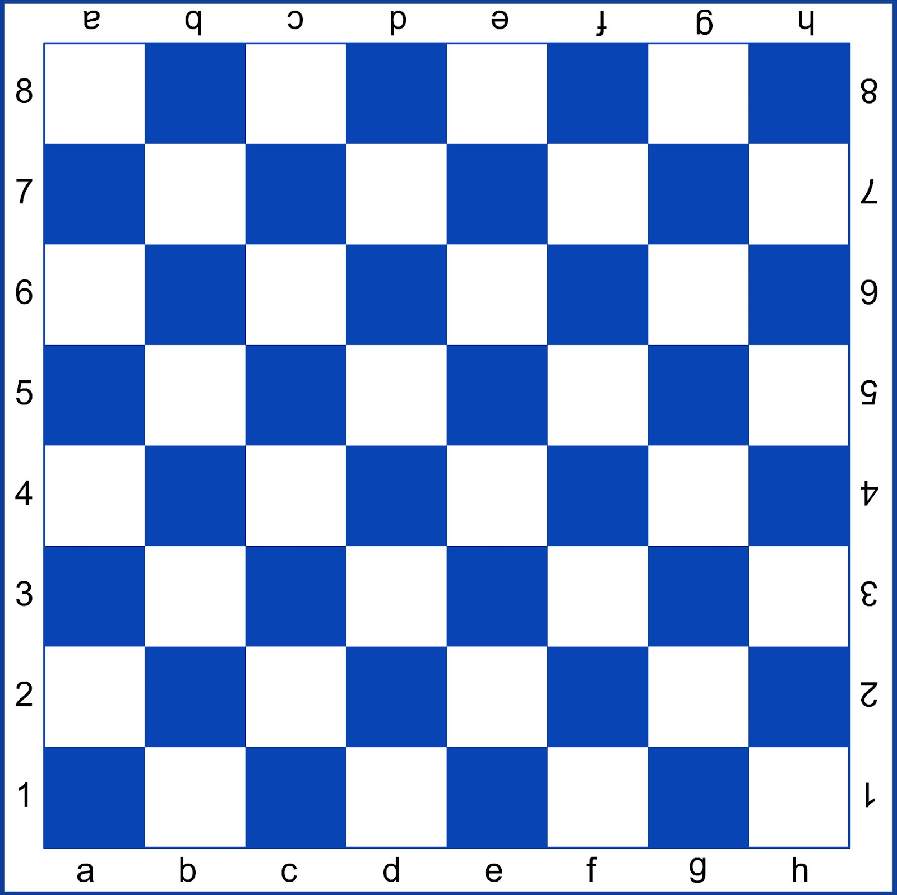

# Лабораторная работа 2 - Циклы и условия

Всем выполнившим задания из первой лабы - *чмок*😘


Дальше больше, стартуем!

## Теория

В C++ существует два оператора ветвления кода:
- `if`
- `switch`

### Оператор `if`
Операторы ветвления позволяют программе менять поведение
в зависимости от какого - либо условия, заданного программистом

У всех в школе было такое: ну вот ЕСЛИ получу сейчас больше 10 баллов за этот чёртов тест, то наконец то в четверти будет пятёрка, ЕСЛИ НЕТ, то опять четыре. Еще можно вспомнить дилемму с вилками и глазами. В общем и целом оператор ветвления работает также.


Вспомним(или узнаем) логические операторы

| Оператор С++ | Условие | Смысл условия        |
|--------------|---------|----------------------|
| ==           | a == b  | a равно b            |
| !=           | a != b  | a не равно b         |
| \>           | a > b   | а больше b           |
| <            | a < b   | a меньше b           |
| \>=          | a >= b  | a больше или равно b |
| <=           | a <= b  | a меньше или равно b |
 
Рассмотрим пример

```c++
#include <iostream> 

int main() {
    int value;
    std::cout << "Enter value: ";
    std::cin >> value;
    
    if ( a > 10) {
        std::cout << "Value is higher than 10";
    } else {
        std::cout << "Value is less or equal to 10";
    }
    std::cout << "\n";
    return 0;
}
```

Таким образом, если пользователь введёт число больше 10, он получит одну строчку, а если меньшее или равное, другую.

### Оператор `if-else if-else`

Расширим этот пример конструкцией `if-else if-else`, ещё один вариант использования оператора if, если у вас еще есть какие либо условия

```c++
#include <iostream>

int main() {
    int value;
    std::cout << "Enter value: ";
    std::cin >> value;
    
    if (a > 10) {
        std::cout << "Value is higher than 10";
    } else if ( a == 10 ) {
        std::cout << "Value is equal to 10";
    } else {
        std::cout << "Value is less than 10";
    }
    std::cout << '\n';
    return 0;
}
```

Теперь, если число равно 10, на консоль будет выведена строка `Value is equal to 10`

### Использование логических операторов

Также в блоках условий можно использовать [логические операторы](https://ravesli.com/urok-43-logicheskie-operatory-i-ili-ne/) (тут нужен впн)

Если просто о логических операторах: их всего три "И" - &&, а также "ИЛИ" - || и ещё один "НЕ" - !. Вернёмся в ту же школу. Например, дежурство по классу. Если учитель говорит о том, что пойдёт Иванов И Петров - значит пойдут дежурить оба, в противном случае указание учителя не будет выполнено, а если учитель говорит о том, что пойдёт Сидоров ИЛИ Фёдоров, то удовлетворительным результатом будут следующие случаи: пошёл Сидоров, пошёл Фёдоров, пошли оба; если не пошёл никто, то указание опять будет считаться не выполненным. Ещё имеется случай, когда учитель говорит о том, что Масленков не пойдёт сегодня дежурить - значит что удовлетворительным результатом будет если дежурным будет не Масленков, в противном случае опять провал. Вот так и работают логические операторы. Наглядным примером так же могут служить таблицы истинности и круги Эйлера.


```c++

#include <iostream>
 
int main()
{
    std::cout << "Enter an integer: ";
    int a;
    std::cin >> a;
 
    std::cout << "Enter another integer: ";
    int b;
    std::cin >> b;
 
    if (a > 0 && b > 0) { // && - это логическое И. Проверяем, являются ли оба условия истинными
        std::cout << "Both numbers are positive\n";
    } else if (a > 0 || b > 0) { // || - это логическое ИЛИ. Проверяем, является ли истинным хоть одно из условий
        std::cout << "One of the numbers is positive\n";
    } else {
        std::cout << "Neither number is positive\n";
    }
    return 0;
```

### Оператор `switch`

Рано или поздно у программиста возникает вопрос: "а зачем использовать что - то кроме `if-else`"?

Рассмотрим пример:

```c++
#include <iostream>
 
enum Colours
{
    COLOUR_GRAY,
    COLOUR_PINK,
    COLOUR_BLUE,
    COLOUR_PURPLE,
    COLOUR_RED
};
 
void printColor(Colours colour)
{
    if (colour == COLOUR_GRAY)
        std::cout << "Gray";
    else if (colour == COLOUR_PINK)
        std::cout << "Pink";
    else if (colour == COLOUR_BLUE)
        std::cout << "Blue";
    else if (colour == COLOUR_PURPLE)
        std::cout << "Purple";
    else if (colour == COLOUR_RED)
        std::cout << "Red";
    else
        std::cout << "Unknown";
}
 
int main()
{
    printColor(COLOUR_BLUE);
 
    return 0;
}
```

Неказисто, некрасиво, можно было бы лучше и лаконичнее. Тут и приходит на помощь оператор `switch`

Switch делает следующее: каждому конкретному случаю (кейсу - case) сопоставляет выполняемый код, также присутствует случай невыполнения всех условий (default). А слово break не более чем обозначается конец выолняемого кода в case и завершает работу с оператором switch. Блок-схема для понимания:


Код:

```c++
#include <iostream>

enum Colours
{
  COLOUR_GRAY,
  COLOUR_PINK,
  COLOUR_BLUE,
  COLOUR_PURPLE,
  COLOUR_RED
};

void printCOLOUR(Colours colour)
{
  std::cout << "The colour is: ";
  switch (colour) {
    case COLOUR_GRAY:
      std::cout << "gray";
      break;
    case COLOUR_PINK:
      std::cout << "pink";
    case COLOUR_BLUE:
      std::cout << "blue";
      break;
    case COLOUR_PURPLE:
      std::cout << "purple";
      break;
    case COLOUR_RED:
      std::cout << "red";
      break;
    default:
      std::cout << "unknown";
      break;
  }
  std::cout << "\n";
}
 
int main()
{
  printCOLOUR(COLOUR_BLUE);
  return 0;
}

```


## Дальнейшее чтение
[Оператор ветвления ч.1](http://cppstudio.com/post/286/) <br/>
[Оператор ветвления ч.2](http://cppstudio.com/post/291/) <br/>
[Логические операции](http://cppstudio.com/post/297/) <br/>
[Оператор switch](http://cppstudio.com/post/306/) <br/>

### Циклы

Цикл — многократное прохождение по одному и тому же коду программы. Циклы необходимы программисту для многократного выполнения одного и того же кода, пока истинно какое-то условие. Если условие всегда истинно, то такой цикл называется бесконечным, у такого цикла нет точки выхода.

В языке программирования С++ существуют такие циклы:

* цикл for
* цикл while
* цикл do  while

Тело цикла будет выполняться до тех пор, пока условие будет истинно(т. е. true).

```c++
// форма записи оператора цикла for:
 
for (/*выражение1*/; /*выражение2*/; /*выражение3*/ )
{
/*один оператор или блок операторов*/;
}
```

Если в теле цикла for должен выполнится один оператор, тогда фигурные скобки можно опустить:

```c++
for (/*выражение1*/; /*выражение2*/; /*выражение3*/)
/*один оператор*/;
}
```

Рассмотрим подробно три выражения записанные в круглых скобках цикла for. Выражение 1 — объявление (и) или инициализация, ранее объявленной, переменной-счетчика, которая будет отвечать за истинность условия в цикле for. Пример:

```c++
int counter = 0; // отсюда видно, что была объявлена переменная counter типа int и инициализирована значением 0
```

Переменная-счетчик всегда должна иметь целочисленный тип данных. Если переменная была объявлена в цикле (все равно в каком), по завершении цикла эта переменная будет уничтожена.

Выражение 2 — это условие продолжения цикла for, оно проверяется на истинность(вспоминаем рассказанное выше).


```c++
counter < 10; // условие истинно пока count строго меньше десяти!
```

Выражение 3 изменяет значение переменной-счетчика. Без выражения 3 цикл считается бесконечным, так как изменение содержимого переменной count выполняться не будет, и если изначально условие было истинным, то цикл будет бесконечным, иначе программа даже не войдет в цикл. Выражения 1, 2, 3 отделяются друг от друга обязательными разделителями, точкой с запятой. Под изменением значения переменной подразумевается уменьшение или приращение значения , например (самый частоиспользуемый вид цикла for):


```c++
for ( int counter = 0; counter < 15; counter++) // выполняется приращение переменной counter с шагом 1 от 0 до 15
```

* ++ это операция инкремента, увеличение значения переменной на единицу;
* -- это операция декремента, уменьшение значения переменной на единицу.

Очень часто неправильно интерпретируется запись пределов в цикле for, в нашем случае приращение переменной counter выполняется с шагом 1 от 0 до 15. Обратите внимание на конечный предел. В условии продолжения цикла стоит знак отношения строго меньше, а значит, когда значение в переменной counter будет равно 14, выполнится выход из цикла. Ниже показан пример работы программы

```c++
int main()
{
    for (int counter = 0; counter < 15; counter ++ ) // начало цикла
         cout << " " << counter; // тело цикла
    cout << endl;
    return 0;
}
```
 Результат: 
 
 
 


От теории к практике, мои дорогии маслятки! Нынче задачи ещё сложнее👍


## Задание 1
С клавиатуры вводятся числа X, Y, Z. Необходимо записать условие, которое является истинным, когда:
* каждое из чисел X и Y нечетное;
* только одно из чисел X и Y меньше 20;
* хотя бы одно из чисел X и Y равно нулю;
* каждое из чисел X, Y, Z отрицательное;
* только одно из чисел X, Y и Z кратно пяти;
* хотя бы одно из чисел X, Y, Z больше 100.
* существует ли треугольник с такими сторонами

В случае, если условие выполняется вывести на экран - `condition is true`, иначе `condition is false`.


## Задание 2
Клетка на шахматной доски определяется парой натуральных чисел, каждое из которых не превосходит 8:
первое число — номер вертикали (при счете слева направо), второе — номер горизонтали (при счете снизу вверх).

Даны две координаты шахматных фигур. Числа x1, y1, x2, y2 не превосходят 8. (Кстати тут было бы здорово использовать структуры)

**Требуется:**
* На поле A(x1, y1) расположена ладья. Записать условие, при котором она угрожает полю B(x2, y2).
* На поле A(x1, y1) расположен слон. Записать условие, при котором он угрожает полю B(x2, y2).
* На поле A(x1, y1) расположен король. Записать условие, при котором он может одним ходом попасть на поле B(x2, y2).
* На поле A(x1, y1) расположен ферзь. Записать условие, при котором он угрожает полю B(x2, y2).
* На поле A(x1, y1) расположена белая пешка. Записать условие, при котором она может одним ходом попасть на поле B(x2, y2):
    * при обычном ходе;
    * когда она "бьет" фигуру или пешку соперника. 

#### Шахматная доска *(если шо)*


## Задание 3
* Составить расписание на неделю. Пользователь вводит порядковый номер дня недели, программа должна вывести то, что запланировано на этот день.
* Пользователь вводит число (необязательно от 1 до 12). Программа должна вывести название месяца.


## Задание 4
Напечатать таблицу умножения на 7:
```
1 х 7 = 7
2 х 7 = 14
...
9 х 7 = 63
```

Напечатать таблицу умножения на `N`, которое вводится с клавиатуры:
```
1 х N = 1*N
2 х N = 2*N
...
9 х N = 9*N
```


## Задание 5
Найти и вывести на экран:
* произведение всех целых чисел от 8 до 15;
* произведение всех целых чисел от a до 20 (значение a вводится с клавиатуры; `1 < a < 20`);
* произведение всех целых чисел от 1 до b (значение b вводится с клавиатуры; `1 < b < 20`);
* произведение всех целых чисел от a до b (значения a и b вводятся с клавиатуры; `b >= a`).

## Задание 6 *(со звёздочкой типа)*
Поскольку у нас тут все умные и молодцы, предлагаю рассмотреть "легендарную" задачу "о восьми ферзях".

Итак, к задаче. Имеется доска NxN клеток. Необходимо рассчитать количество возможных расстановок N ферзей
на данной доске так, чтобы они друг друга не "били".
